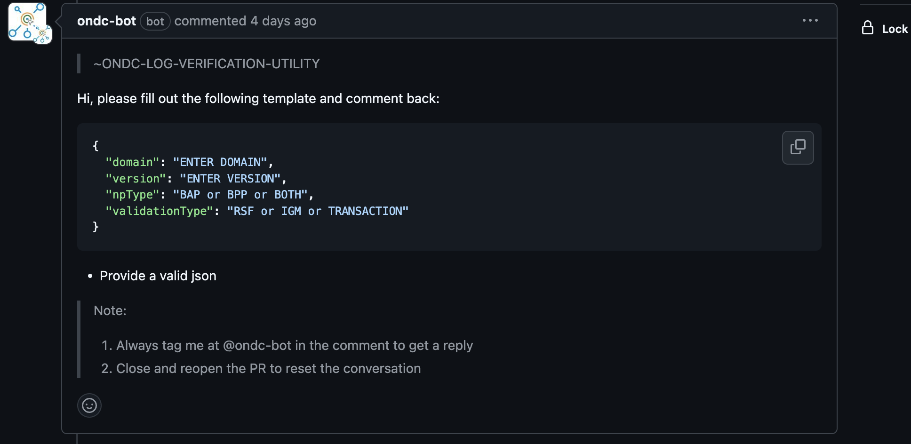
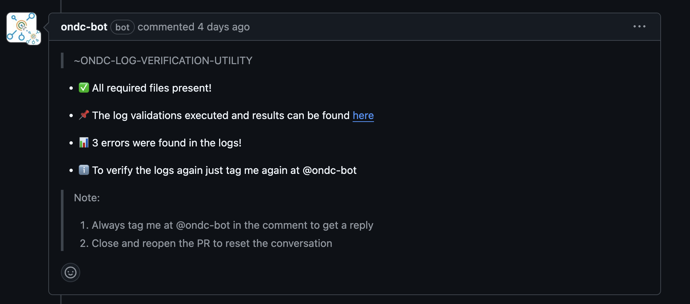

# ONDC-GITHUB-BOT

> A GitHub App built with [Probot](https://github.com/probot/probot) that works with services and utilities created by [ONDC](https://github.com/ONDC-Official)

### Current Features:

- Run [log validation utlity](https://github.com/ONDC-Official/log-validation-utility) on the pull request for log verifications and get the related issue comments in real time.

  #### Usage:

  - As soon as any PR is raised on any log verification repositories the bot creates a comment with instructions for the author to run the utlity on the submited logs.

    

  - After the User Responds with the required information the BOT runs the [log validation utlity](https://github.com/ONDC-Official/log-validation-utility) and comments back to the author.

    

## Setup

```sh
# Install dependencies
npm install

# Run the bot
npm run dev
```

## Contributing

If you have suggestions for how LogBotX could be improved, or want to report a bug, open an issue! We'd love all and any contributions.

For more, check out the [Contributing Guide](CONTRIBUTING.md).

## License

[ISC](LICENSE) © 2024 ONDC
